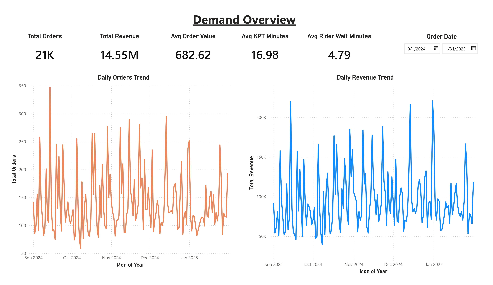
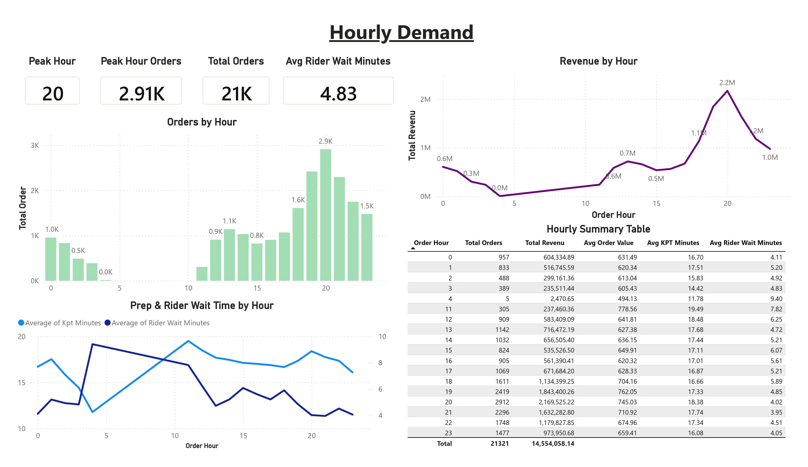
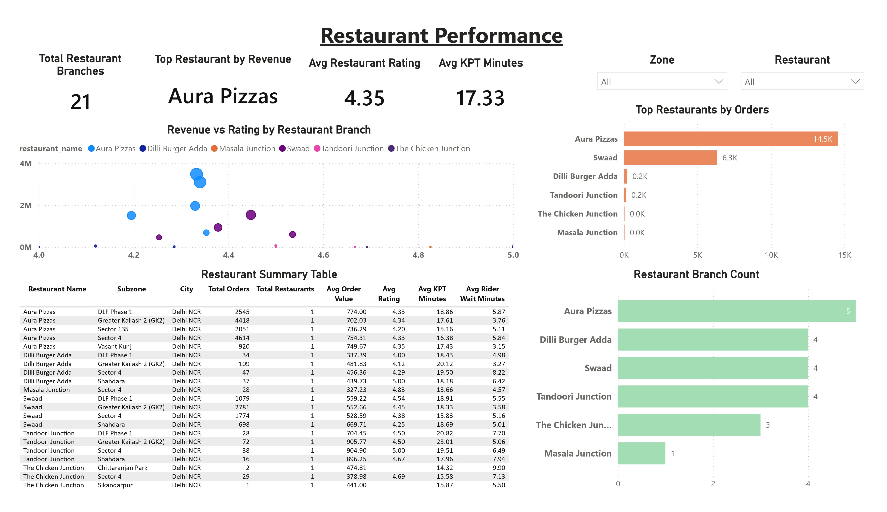
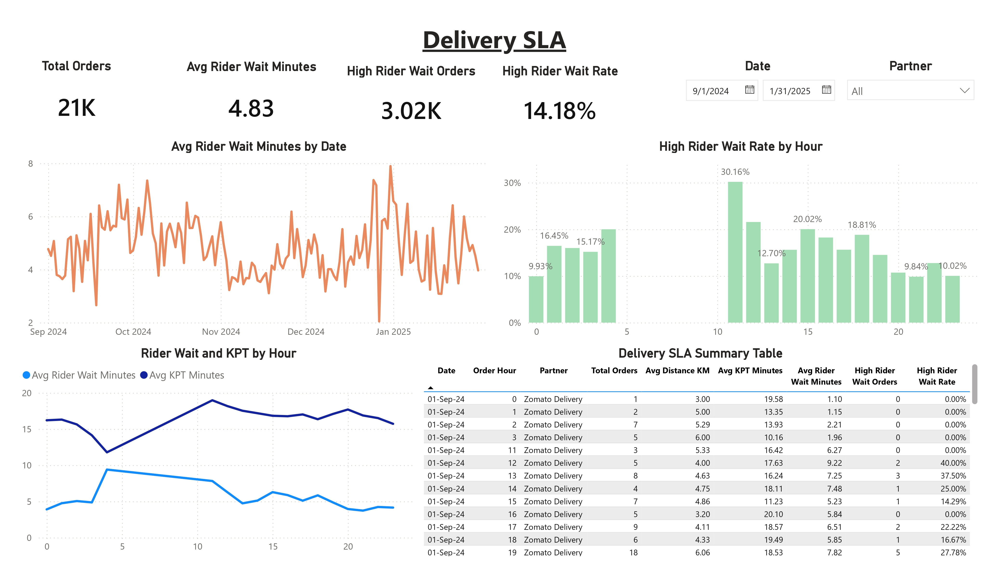

# Food Delivery Demand Azure Airflow Pipeline

End-to-end food delivery analytics pipeline using Apache Airflow, Docker, Azure Blob Storage, Azure SQL Database, and Power BI.

## Project Objective

This project builds a cloud-based data pipeline for food delivery analytics. The pipeline ingests food delivery order data, lands raw files in Azure Blob Storage, loads data into Azure SQL Database, transforms staging data into warehouse and mart layers, and visualizes business insights in Power BI.

The goal is to analyze food delivery demand, peak order hours, restaurant performance, and delivery SLA metrics to support operational planning.

## Tech Stack

- Python
- Apache Airflow
- Docker
- Azure Blob Storage
- Azure SQL Database
- SQL
- Power BI
- GitHub

## Architecture

```text
Food Delivery CSV
        |
        v
Airflow + Docker Local
        |
        v
Azure Blob Storage
raw/food_delivery/orders/load_date=YYYY-MM-DD/orders.csv
        |
        v
Azure SQL Database
staging -> warehouse -> mart
        |
        v
Power BI Dashboard
```

## Data Pipeline

### 1. Raw Landing

The raw food delivery CSV is uploaded to Azure Blob Storage using Airflow.

Example blob path:

```text
raw/food_delivery/orders/load_date=2026-07-01/orders.csv
```

### 2. Staging Layer

Raw data is loaded into Azure SQL staging table:

```text
staging.stg_food_delivery_orders
```

The staging layer keeps the source structure close to the original dataset while applying readable column names and SQL data types.

### 3. Warehouse Layer

The warehouse layer organizes data into analytics-friendly tables:

```text
warehouse.dim_restaurant
warehouse.dim_customer
warehouse.fact_orders
```

### 4. Mart Layer

The mart layer prepares report-ready views for Power BI:

```text
mart.mart_daily_orders
mart.mart_hourly_demand
mart.mart_restaurant_performance
mart.mart_delivery_sla
```

## Airflow DAGs

| DAG | Purpose |
|---|---|
| `hello_food_delivery_pipeline` | Checks that Airflow can read the local raw CSV |
| `local_raw_landing_pipeline` | Simulates raw landing locally before Azure upload |
| `upload_raw_to_azure_blob` | Uploads raw CSV to Azure Blob Storage |
| `create_azure_sql_staging_table` | Creates Azure SQL staging schema and table |
| `load_blob_to_azure_sql_staging` | Loads Azure Blob CSV into Azure SQL staging |
| `build_warehouse_tables` | Builds warehouse tables and mart views |

## Data Model

```text
staging.stg_food_delivery_orders
        |
        v
warehouse.dim_restaurant
warehouse.dim_customer
warehouse.fact_orders
        |
        v
mart.mart_daily_orders
mart.mart_hourly_demand
mart.mart_restaurant_performance
mart.mart_delivery_sla
```

## Power BI Dashboard

The Power BI dashboard contains four pages:

1. Demand Overview
2. Hourly Demand
3. Restaurant Performance
4. Delivery SLA

### Demand Overview



### Hourly Demand



### Restaurant Performance



### Delivery SLA



## Key Metrics

- Total orders
- Total revenue
- Average order value
- Peak order hour
- Average rider wait time
- High rider wait rate
- Restaurant revenue performance
- Restaurant branch count

## Data Quality Checks

The project includes checks for:

- Row count by load date
- Duplicate order IDs
- Null critical fields
- Negative numeric values
- Invalid rating values
- Order status distribution
- Delivery partner distribution

## Project Learnings

This project demonstrates:

- Building an Airflow pipeline with Docker
- Uploading raw data to Azure Blob Storage
- Loading cloud data into Azure SQL Database
- Designing staging, warehouse, and mart layers
- Handling real-world schema issues such as long customer IDs and text-based item columns
- Creating Power BI dashboards from SQL mart views
- Managing cloud cost by running Airflow locally and using Azure only for storage and database layers

## Cost-Aware Design

Airflow runs locally with Docker to avoid cloud compute costs. Azure is used for Blob Storage and Azure SQL Database, keeping the project suitable for a low-budget learning environment.

## Project Status

Completed initial end-to-end version.